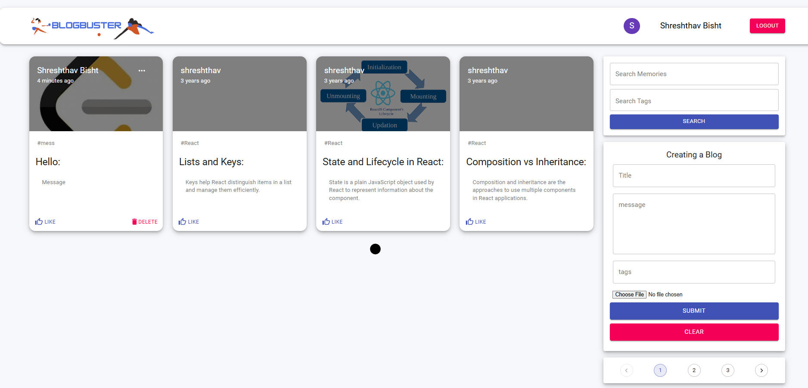

---

# Online Blog Application - using MERN stack

Welcome to the Online Blog Application, built using the **MERN** stack (MongoDB, Express, React, Node.js). This application allows users to create, read, update, delete (CRUD) blog posts with images, messages, and tags. It also supports memory search, filters, and pagination to help users navigate through posts easily.




## Features:

- **CRUD Operations**: 
  - **Create**: Users can add new blog posts with titles, messages, tags, and optional images.
  - **Read**: View a list of existing blog posts with cards displaying their title, message, tags, and creation date.
  - **Update**: Edit existing posts with new content, tags, and images.
  - **Delete**: Remove blog posts from the database.
  
- **Search & Filter**:
  - Search posts by keywords (e.g., memories, tags).
  - Filter posts based on tags to narrow down content.
  
- **Pagination**:
  - Blog posts are displayed in pages, allowing users to easily navigate through large datasets.
  - Control the number of posts per page using pagination controls.
  
- **Image Support**:
  - Users can upload images while creating a new post.
  - Images are stored and displayed within blog posts.
  
- **Responsive Design**:
  - The application is designed to be responsive, providing an optimized experience across all devices (e.g., mobile, tablet, desktop).
  
## Tech Stack:

- **Frontend**: 
  - **React**: A JavaScript library for building user interfaces.
  - **CSS**: Styled components for styling.
  
- **Backend**: 
  - **Node.js**: JavaScript runtime environment.
  - **Express**: Web application framework for Node.js.
  - **MongoDB**: NoSQL database to store data.
  
## Installation Guide:

### 1. **Clone the Repository**:

First, clone the project from the GitHub repository:

```bash
git clone https://github.com/your-username/online-blog-application.git
```

### 2. **Navigate to the Project Directory**:

```bash
cd online-blog-application
```

### 3. **Install Dependencies**:

Run the following commands to install dependencies for both the frontend and the backend:

```bash
# Install frontend dependencies
cd client
npm install

# Install backend dependencies
cd ..
npm install
```

### 4. **Setup Environment Variables**:

Create a `.env` file in the root directory of your project and add the following environment variables:

```bash
# Backend environment variables
MONGO_URI = 'mongodb://localhost:27017/blogDB'
JWT_SECRET = 'your-secret-key'

# Frontend environment variables
REACT_APP_API_BASE_URL = 'http://localhost:5000'
```

### 5. **Run the Application**:

First, start the backend server:

```bash
cd server
npm start
```

Then, in a separate terminal window, run the following command to start the frontend:

```bash
cd client
npm start
```

### 6. **Access the Application**:

Open your browser and go to `http://localhost:3000` to use the application.

## How It Works:

1. **Create a New Post**:
   - Fill out the title, message, tags, and optionally upload an image.
   - Click "Submit" to create a new post.
   - The post will appear in the list of blog posts.
  
2. **Read & Navigate**:
   - View all posts with the option to search memories and tags.
   - Posts are shown in paginated format (e.g., 5 posts per page).
   - Click on posts to view their content.
   
3. **Edit or Delete Posts**:
   - Click the "Edit" button to update the title, message, tags, and image.
   - Click the "Delete" button to remove posts from the database.
   
4. **Search & Filter**:
   - Type keywords in the search bar to find relevant posts.
   - Use the filter options to display posts by specific tags.
   
## Pagination:

- Pagination is used to manage content and optimize performance.
- Navigate between pages using pagination controls.
- Customize the number of posts displayed per page in the application settings.

## Security:

- **User Authentication**: The application uses JWT tokens for user authentication and authorization.
- **Secure Environment Variables**: Environment variables like `JWT_SECRET` and `MONGO_URI` should be stored securely and not committed to version control.
- **Image Upload**: Uploaded images are stored and managed securely.

## Future Enhancements:

- **Real-time Comments**: Add a feature to allow users to comment on posts.
- **Improved Search Algorithms**: Implement fuzzy search or other advanced search techniques.
- **Tags Management**: Allow users to create custom tags.
- **User Profile Pages**: Enable user profiles with personalized content and user-specific posts.

---
